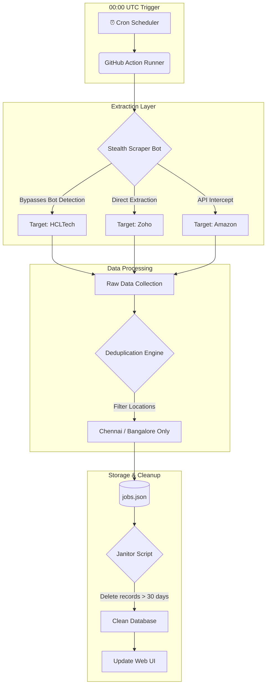

<div align="center">

# 📡 ALL_CAREER — Intelligent Job Aggregator

An automated, stealth-enabled ETL pipeline that extracts job market intelligence from top tech companies.  

<br />

[](https://ragesh28.github.io/ALL_CAREER/)

<br /><br />


</div>

---

## 🌟 Why ALL_CAREER?

Many job boards are cluttered, slow, and flooded with outdated listings.  
**ALL_CAREER** solves this by:  

- Directly scraping official career portals of companies like Zoho, HCL, Amazon  
- Running as a fully automated, daily-triggered ETL pipeline  
- Filtering and cleaning data — delivering a clean, private feed of fresh jobs  

Whether you’re job-hunting, building a job-market dashboard, or tracking trends — ALL_CAREER gives you a reliable, up-to-date dataset.

---

## 🧬 Core Architecture

> High-level overview of how the system works



---

## 🚀 Features

- **Stealth scraping** — avoids detection using puppeteer-extra-plugin-stealth, realistic viewports, and smart waiting  
- **Automatic filtering & deduplication** — keeps only relevant, new jobs for specified locations  
- **Auto-maintenance** — cleans old/expired listings automatically (older than 30 days)  
- **Simple web UI** — lets you browse jobs and practice problems mapped by company  

---

## 🧰 What’s Inside

- `scrape.js`, `find_selectors.js` — core scraping logic  
- `clean_jobs.js` — maintenance script to prune old listings  
- `jobs_data.js`, `leetcode_data.js` — stored data for job listings and practice tasks  
- HTML UI files: `career_explorer.html`, `daily_jobs.html`, `practice.html`, etc. — for viewing data in browser  
- `package.json` / `package-lock.json` — Node.js configuration & dependencies  

---

## 📥 Installation & Local Setup

### Clone the repository
```bash
git clone https://github.com/ragesh28/ALL_CAREER.git
cd ALL_CAREER
```

### Install dependencies
```bash
npm install
```

### Run locally
```bash
npm start
```

### (Optional) Trigger scraping manually
```bash
node scrape.js
```

---

## ⚙️ Deployment (GitHub + GitHub Pages)

- Ensure GitHub Actions are enabled (for automated scraping + maintenance)
- Go to **Settings → Pages**, pick the `main` branch as source, and save — GitHub Pages will host the UI

---

## ✅ Usage

Once set up, the system will:

- Automatically fetch job listings daily  
- Clean old listings (> 30 days)  
- Regenerate JSON data and update web UI — accessible via GitHub Pages  

You can view jobs, filter by company or location, and also check a curated set of practice problems (company-wise).

---

## 🤝 Contributing

Feel free to contribute! Things you can help with:

- Add support for more companies  
- Improve scrapers or selector logic  
- Extend web UI (new filters, search, etc.)  
- Add unit tests or data validation scripts  

If you make a change:
```bash
git add .
git commit -m "feat: add <description>"
git push
```
Please follow standard GitHub pull-request workflow.

---

## 📄 License

This project is licensed under the MIT License. See the LICENSE file for details.

---

## 🔗 Related Projects / Resources

- Built with Node.js, Puppeteer — works cross-platform  
- For context on good README practices: see any standard README guidelines  

*(Last updated: 2025-12-10)*
<div align="center">

Maintained by Ragesh

</div>