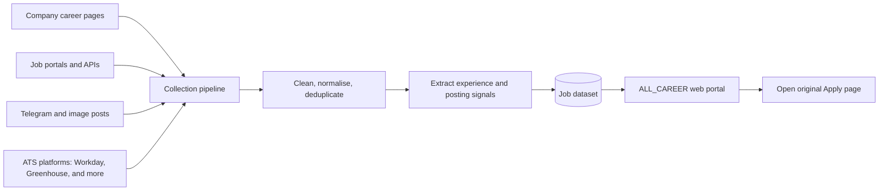
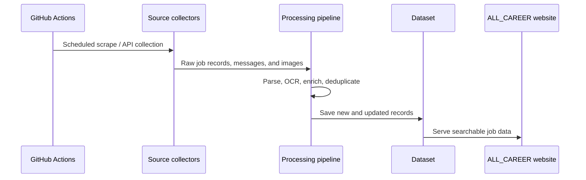

# ALL_CAREER

### A focused job-discovery hub for direct-company, portal, and community opportunities.

  

---

## The problem

Finding a suitable job should not require checking many websites every day. In practice, a job seeker has to search job portals, LinkedIn posts, Telegram channels, walking-interview announcements, and the career sites of individual companies.

The biggest gap is that many large companies, including companies such as Google, Microsoft, Salesforce, Oracle, and other top MNCs, publish jobs first or only on their own career pages and ATS platforms such as Workday and Greenhouse. These opportunities can be missed when someone searches only on Naukri, Indeed, or LinkedIn.

There are also quality problems in the source data:

- A posting date is often missing or unclear.
- Required experience is frequently hidden inside a long job description.
- The same job can appear across several sources.
- Telegram and image-based job posts are difficult to search and filter.
- Premium company-wise coding-question collections are not affordable for every learner.

## The ALL_CAREER solution

ALL_CAREER is a personal, educational job-discovery platform that brings these sources together, cleans the data, highlights what is new, and provides company-focused coding preparation in the same experience.

It combines direct-company career pages, ATS feeds, job portals, public job posts, and community sources into a single searchable job portal. The platform identifies new opportunities by comparing each incoming record against the existing dataset, extracts useful signals such as experience requirements, and links every result back to its original application page.

```mermaid
flowchart LR
    A[Company career pages] --> E[Collection pipeline]
    B[Job portals and APIs] --> E
    C[Telegram and image posts] --> E
    D[ATS platforms: Workday, Greenhouse, and more] --> E
    E --> F[Clean, normalise, deduplicate]
    F --> G[Extract experience and posting signals]
    G --> H[(Job dataset)]
    H --> I[ALL_CAREER web portal]
    I --> J[Open original Apply page]
```

## What the platform includes

| Area | What it does |
| --- | --- |
| **All Jobs** | A unified feed built from 10+ job sources, with filtering and links to the original job pages. |
| **Big Company Jobs** | Direct job listings and career-page links for major companies and top MNCs. |
| **Company Directory** | Around 150 company career links, so users can check official openings directly. |
| **New-job detection** | Compares incoming jobs with saved records to mark opportunities that are newly discovered by the pipeline. |
| **Experience extraction** | Uses pattern matching / regex over job descriptions to surface experience requirements that portals may not show clearly. |
| **Telegram and image posts** | Uses Telethon for channel messages and OCR + AI-assisted extraction for image-based announcements. |
| **Learn Coding** | Company-oriented coding-practice discovery. The underlying curated data is served from a private cloud dataset and is not published in this repository. |
| **Auto Apply extension (in development)** | A browser-extension project intended to open a job's original application site and assist with form filling, while keeping the user in control of review and submission. |

## Data collection approach

The project uses different collection techniques because one method does not work for every source:

- Official company career pages and public ATS feeds, including Workday and Greenhouse-style systems.
- Job-board APIs and structured data exposed by portal pages.
- Browser-based extraction for pages that need a rendered session.
- Direct HTML and JSON/JSON-LD parsing where structured data is available.
- Telegram message collection through **Telethon**.
- OCR for image-based posts, followed by AI-assisted job and post extraction.
- Deduplication, cleanup, role grouping, and incremental merge steps before records appear in the portal.

The pipeline has collected and processed **200,000+ job records** from varied sources. Individual source coverage can change when a website changes its public interface or access rules.

## Daily automation

GitHub Actions runs the collection and update workflows on scheduled intervals, including daily runs around **3:00 AM IST** for several sources. Long-running collections save progress and can continue from checkpoints, helping the project maintain a fresh dataset without manual daily work.

```mermaid
sequenceDiagram
    participant GA as GitHub Actions
    participant S as Source collectors
    participant P as Processing pipeline
    participant D as Dataset
    participant W as ALL_CAREER website

    GA->>S: Scheduled scrape / API collection
    S->>P: Raw job records, messages, and images
    P->>P: Parse, OCR, enrich, deduplicate
    P->>D: Save new and updated records
    D->>W: Serve searchable job data
```

## Experience and freshness signals

Job boards do not always expose the information candidates need most. ALL_CAREER improves this in two ways:

1. **Experience requirements**: the pipeline scans the complete job description with regex and extraction rules to identify patterns such as `0-2 years`, `3+ years`, or `minimum 5 years`.
2. **New opportunities**: incoming records are checked against the current dataset. When a record was not previously present, the portal can present it as a newly discovered job.

These are extraction signals, not guarantees. Candidates should always confirm eligibility, experience requirements, and deadlines on the original employer page.

## Auto Apply extension - current development work

`autofill-v4` is the companion browser-extension project. It is being developed to make the transition from job discovery to the employer's original application page easier.

Planned and active development areas include:

- Opening the official application page from an ALL_CAREER **Apply** action.
- Detecting text fields, radio buttons, checkboxes, comboboxes, and next-step buttons.
- Using configurable LLM providers such as Gemini, OpenRouter, and other supported providers for field understanding and safe action selection.
- Preserving user control for passwords, unknown fields, uploads, CAPTCHAs, account creation, and final submission.
- Tracking application progress during the current session and showing jobs that need review.

> The extension is still under development. It must not bypass CAPTCHAs, website security, employer restrictions, or a candidate's final review. Always verify every application before submitting it.

## Privacy and responsible use

This is a **personal educational project**. It is designed to help organise publicly available job information and direct candidates to original application pages.

- No API keys, personal credentials, or private cloud datasets are included in this repository.
- The company-wise coding-practice data is cloud-served and intentionally not stored in the public repository.
- Source sites, job portals, and employer pages have their own terms and policies. Users are responsible for complying with them.
- Job details can change quickly; the original company or portal page is always the source of truth.

## Project structure

| Path | Purpose |
| --- | --- |
| `index.html`, `all_jobs.html`, `big_company_jobs.html` | Main portal pages and job browsing UI. |
| `scrape_*.py`, `workday_scraper/` | Source-specific collection, parsing, and ATS/career-page helpers. |
| `merge_scraped_jobs.py`, `cleanup_pipeline.py`, `extractor_utils.py` | Data merge, cleanup, enrichment, and extraction utilities. |
| `jobs_by_role/`, `role_index.json` | Role-oriented job views and indexes. |
| `autofill-v4/` | In-progress companion browser extension for application assistance. |
| `.github/workflows/` | Scheduled GitHub Actions collection and update workflows. |

## Product direction

ALL_CAREER is being built around one simple idea: **job discovery, job understanding, and interview preparation should be connected**.

The goal is not to replace employer career sites. The goal is to make it easier for candidates to find direct openings, understand hidden requirements faster, prepare company-wise, and continue to the official application page with less repetitive searching.

---

Built by Ragesh for personal learning and educational use. 
<a href="https://ragesh28.github.io/ALL_CAREER/">Open the ALL_CAREER portal</a>

